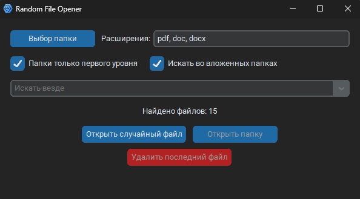

# Random File Opener

Простая утилита с графическим интерфейсом для открытия случайного файла из указанной папки.



## 📌 Возможности

* **Выбор директории:** Укажите любую папку на вашем компьютере для сканирования.
* **Фильтр по расширениям:** Ищите файлы только с нужными расширениями (например, видео `.mp4, .mkv, .avi` или билеты к экзаменам `.pdf, .doc, .docx`).
* **Фильтр по префиксам и постфиксам:** Фильтруйте файлы по началу или концу имени файла (без расширения). Например, `_edit` или `_final`. Поддерживает множественные значения через запятую.
* **Инверсия фильтра:** Опция «НЕ» для исключения файлов с указанными префиксами или постфиксами.
* **Рекурсивный поиск:** Включите поиск во всех вложенных папках или ищите файлы только в папке верхнего уровня.
* **Фильтр по подпапкам:** Быстро переключайтесь между поиском по всей директории или только в конкретной подпапке.
* **Управление файлами:**
  * **Открыть случайный файл:** Запускает случайный файл в приложении по умолчанию.
  * **Показать в проводнике:** Открывает папку, в которой находится последний выбранный файл и выделяет его.
  * **Удалить файл:** Перемещает последний выбранный файл в корзину.
* **Сохранение настроек:** Все ваши настройки (папка, расширения, опции поиска) сохраняются и загружаются при следующем запуске.
* **Кроссплатформенность:** Работает на Windows, macOS и Linux.

## 💻 Для пользователей Windows (релиз в одном бинарнике)

Для пользователей Windows, у которых не установлен Python, доступна автономная `.exe` версия приложения. Вам не нужно ничего устанавливать дополнительно.

Просто скачайте последнюю версию `RandomFileOpener.exe` со страницы **Релизы** и запустите файл.

## 🐍 Установка и запуск

Если вы хотите запустить приложение из исходного кода, вам понадобится **Python 3.8+**.

### 1. Клонируйте репозиторий

```bash
git clone https://github.com/Sarvensky/random_opener.git
cd random_opener
```

_Так же можно просто скачать архив с последней версией из релиза._

### 2. Установите зависимости

Приложение использует несколько внешних библиотек, которые нужно установить:

```bash
pip install -r requirements.txt
```

### 3. Запустите приложение

```bash
python main.pyw
```

> **Примечание:** Файл `main.pyw` используется для того, чтобы на Windows приложение запускалось без окна консоли. На macOS и Linux вы можете запускать его как `python main.py`, предварительно сменив расширение.
